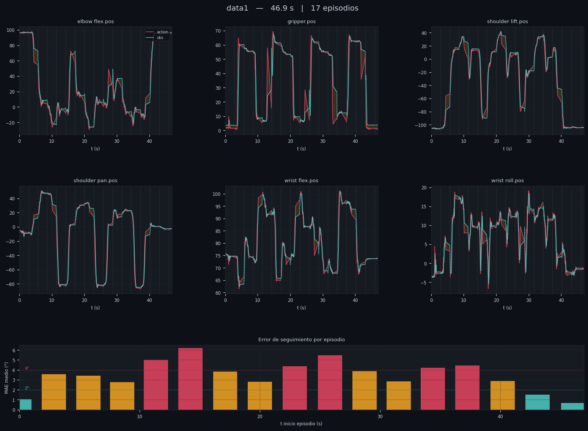
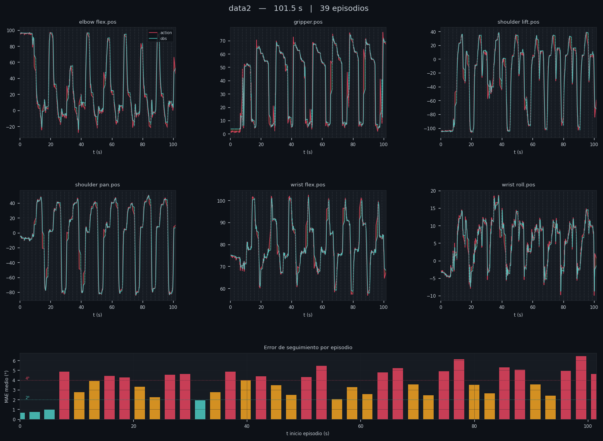
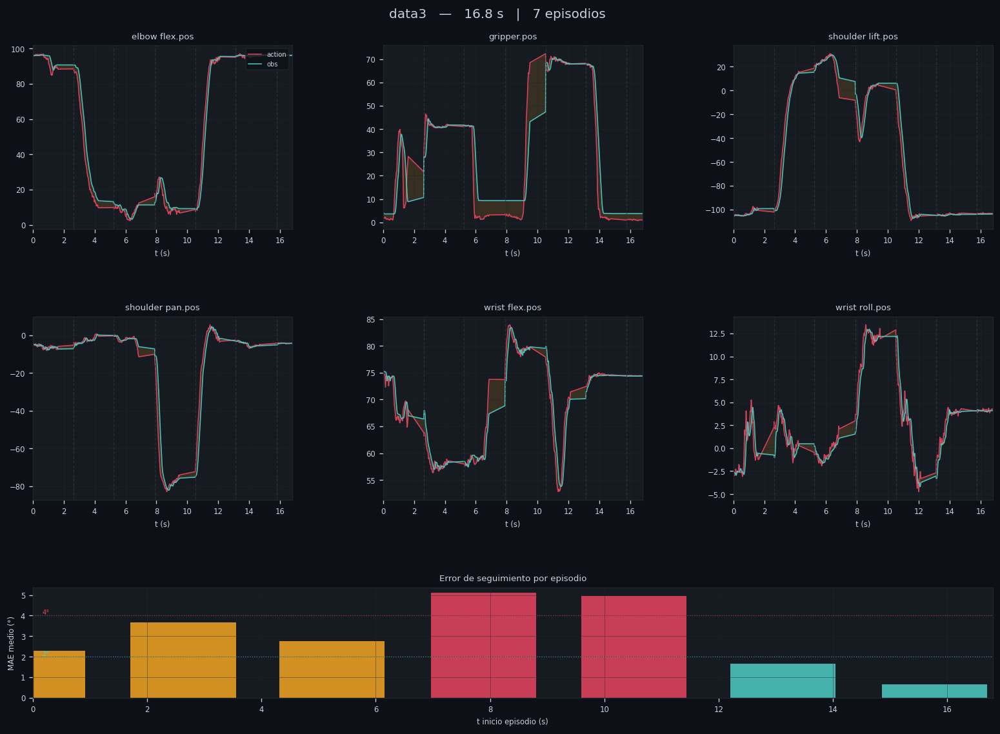
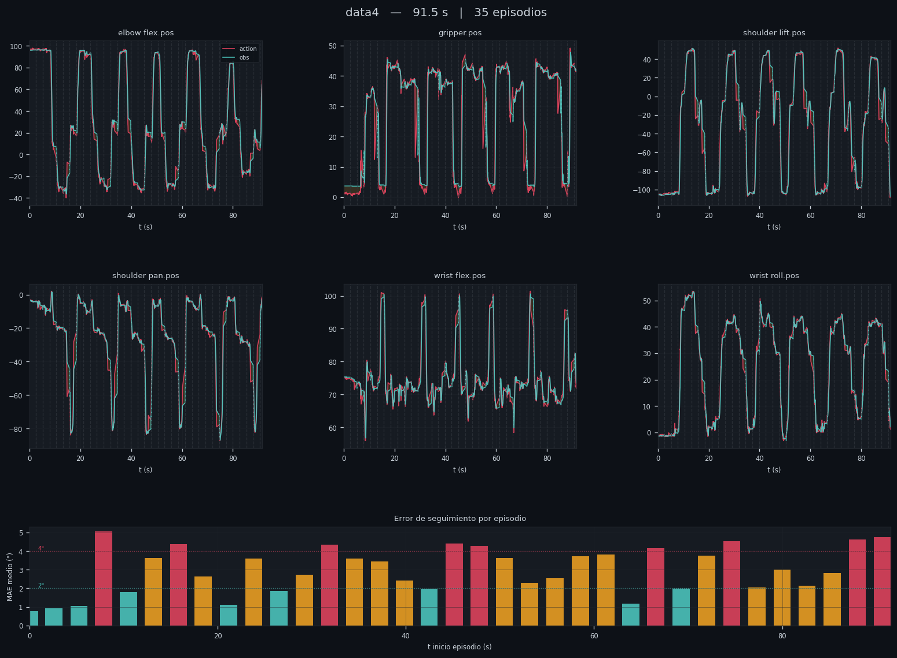
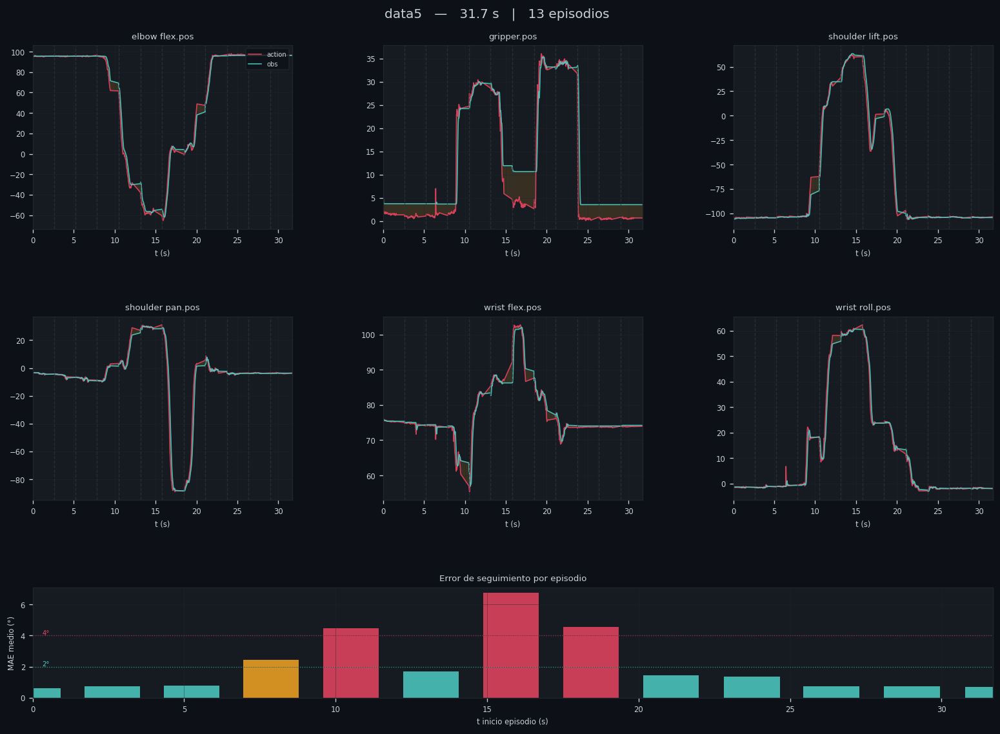

# VLA Manipulation with SO101 - Kitchen Pick & Place

**Tecnológico de Monterrey**

A Vision-Language-Action (VLA) system that enables the SO101 robot arm to pick food items and place them in a pan, conditioned on natural language instructions. The system learns directly from human teleoperation demonstrations using the SmolVLA architecture fine-tuned on a custom dataset.

---

## Table of Contents

1. [Introduction](#introduction)
2. [Problem Formulation](#problem-formulation)
3. [Dataset](#dataset)
4. [Methodology](#methodology)
5. [System Architecture](#system-architecture)
6. [Requirements](#requirements)
7. [Usage](#usage)
8. [Experiments & Results](#experiments--results)
9. [Demo Videos](#demo-videos)
10. [Discussion](#discussion)
11. [Repository Structure](#repository-structure)
12. [Team](#team)

---

## Introduction

This project implements a Vision-Language-Action model for dexterous robotic manipulation using the SO101 robot. The robot is tasked with identifying a target food item from a set of three: sausage, lettuce, and potato; and placing it in a pan, guided by a natural language instruction provided at inference time.

The VLA approach was selected over classical imitation learning because it allows a single policy to handle multiple object classes through language conditioning, without requiring separate models per class.

---

## Problem Formulation

| Element | Description |
|---------|-------------|
| **Observations** | RGB image (640x480, top-down camera) + robot joint positions (6 joints) |
| **Actions** | Joint position targets for the 6 motors of the SO101 follower arm |
| **Classes** | Salchicha (sausage), Lechuga (lettuce), Papa (potato) |
| **Task objective** | Pick the target object and place it in the pan |
| **Language conditioning** | Natural language instruction selects the target class at runtime |
| **Success criterion** | Object correctly deposited in the pan within the episode time limit |

---

## Dataset

| Property | Value |
|----------|-------|
| **HuggingFace repo** | [LuxFeroRN/kitchen](https://huggingface.co/datasets/LuxFeroRN/kitchen) |
| **Total episodes** | 150 |
| **Episodes per class** | 50 |
| **Episode duration** | 20 seconds |
| **Camera** | Single top-down view, 640x480 @ 30 fps |
| **Format** | LeRobotDataset (parquet + AV1 video) |

### Language Instructions

```
"Pon la salchicha en el sarten"   →  50 episodes
"Pon la lechuga en el sarten"     →  50 episodes
"Pon la papa en el sarten"        →  50 episodes
```

### Data Collection Protocol

- All three objects were present in the scene during every episode
- Target object position varied ±5 cm and ±30° rotation per episode
- Distractor objects also varied position to prevent position-based shortcuts
- Pan position was fixed across all episodes (marked with tape)
- Demonstrations collected via teleoperation with the SO101 leader arm

---

## Methodology

### Vision-Language-Action (VLA)

A VLA model integrates three components into a single end-to-end policy:

- **Vision** — a visual encoder processes the camera frame into a spatial representation
- **Language** — a language model encodes the task instruction into a conditioning vector
- **Action** — an action decoder predicts the next joint targets conditioned on both visual and language inputs

At inference time, the language instruction selects the target object without requiring retraining. This allows a single 150-episode dataset to cover all three manipulation classes.

### Model: SmolVLA

The policy is based on [SmolVLA](https://huggingface.co/lerobot/smolvla_base), a compact VLA architecture built on SmolVLM2. It was fine-tuned from the pretrained base weights on the kitchen dataset.

| Property | Value |
|----------|-------|
| **Policy** | [LuxFeroRN/kitchen_smolvla_policy2](https://huggingface.co/LuxFeroRN/kitchen_smolvla_policy2) |
| **Base model** | `lerobot/smolvla_base` |
| **Training steps** | 100,000 |
| **Batch size** | 8 |
| **Hardware** | NVIDIA RTX A6000 (48 GB VRAM) |

---

## System Architecture

```
┌─────────────────────────────────────────────────────────┐
│                     Perception                          │
│   Top-down camera (640x480 @ 30fps)                     │
│              │                                           │
│              ▼                                           │
│        Visual Encoder (SmolVLM2)                        │
└──────────────────────┬──────────────────────────────────┘
                       │
┌──────────────────────▼──────────────────────────────────┐
│                  Language Conditioning                   │
│   "Pon la [objeto] en el sarten"                        │
│              │                                           │
│              ▼                                           │
│        Language Encoder (SmolVLM2)                      │
└──────────────────────┬──────────────────────────────────┘
                       │
┌──────────────────────▼──────────────────────────────────┐
│                  Action Decoding                         │
│   Joint state (6 DOF) + visual + language tokens        │
│              │                                           │
│              ▼                                           │
│        Action chunk (joint targets)                     │
└──────────────────────┬──────────────────────────────────┘
                       │
              ┌────────▼────────┐
              │   SO101 Follower │
              │  (6 Feetech     │
              │   servo motors) │
              └─────────────────┘
```

---

## Requirements

### Hardware

- SO101 follower arm + SO101 leader arm
- USB camera (top-down, fixed mount)
- GPU with at least 8 GB VRAM for training

### Software

```bash
# Clone LeRobot
git clone https://github.com/huggingface/lerobot.git
cd lerobot

# Install with Feetech motor support
pip install -e ".[feetech]"

# Authenticate with HuggingFace
huggingface-cli login
```

### Device ports (adjust to your system)

| Device | Port |
|--------|------|
| SO101 follower | `/dev/ttyACM0` |
| SO101 leader | `/dev/ttyACM1` |
| Camera | `/dev/video0` |

---

## Usage

### 1. Test the camera

```bash
python3 scripts/open_camera.py
```

### 2. Collect demonstration data

```bash
lerobot-record \
    --robot.type=so101_follower \
    --robot.port=/dev/ttyACM0 \
    --robot.id=my_follower \
    --robot.cameras="{ front: {type: opencv, index_or_path: /dev/video0, width: 640, height: 480, fps: 30}}" \
    --teleop.type=so101_leader \
    --teleop.port=/dev/ttyACM1 \
    --teleop.id=my_leader \
    --display_data=true \
    --dataset.repo_id=YOUR_HF_USER/kitchen \
    --dataset.root=./data/kitchen \
    --dataset.num_episodes=50 \
    --dataset.single_task="Pon la salchicha en el sarten" \
    --dataset.episode_time_s=20 \
    --dataset.reset_time_s=40 \
    --dataset.streaming_encoding=true \
    --dataset.encoder_threads=2
```

Repeat with `--dataset.single_task="Pon la lechuga en el sarten"` and `--dataset.single_task="Pon la papa en el sarten"` for the other two classes, using `--resume=true` and the same `--dataset.root`.

### 3. Train the VLA policy

```bash
lerobot-train \
    --dataset.repo_id=YOUR_HF_USER/kitchen \
    --policy.path=lerobot/smolvla_base \
    --output_dir=outputs/train/kitchen_smolvla \
    --hub.repo_id=YOUR_HF_USER/kitchen_smolvla_policy \
    --training.num_steps=100000 \
    --device=cuda
```

### 4. Evaluate the policy on the robot

```bash
lerobot-record \
    --robot.type=so101_follower \
    --robot.port=/dev/ttyACM0 \
    --robot.id=my_follower \
    --robot.cameras="{ front: {type: opencv, index_or_path: /dev/video0, width: 640, height: 480, fps: 30}}" \
    --display_data=true \
    --dataset.repo_id=YOUR_HF_USER/eval_kitchen \
    --dataset.single_task="Pon la salchicha en el sarten" \
    --dataset.streaming_encoding=true \
    --dataset.encoder_threads=2 \
    --policy.path=YOUR_HF_USER/kitchen_smolvla_policy
```

---

## Experiments & Results

Policy performance was evaluated across 5 runs (data1–data5) totalling 111 episodes. Each run was analyzed for tracking accuracy, trajectory smoothness, motion efficiency, and cross-episode consistency.

### Summary

| Run | Episodes | MAE mean (°) | Smoothness std (°) | Episode duration (s) | Consistency std mean (°) |
|-----|----------|--------------|--------------------|----------------------|--------------------------|
| data1 | 17 | 3.54 | 1.19 | 5.58 | 30.9 |
| data2 | 39 | 3.78 | 1.37 | 5.58 | 27.9 |
| data3 | 7  | 3.34 | 1.16 | 5.54 | 29.0 |
| data4 | 35 | 2.90 | 1.26 | 5.60 | 28.5 |
| **data5** | **13** | **1.99** | **0.80** | **1.50** | 29.9 |

> MAE mean and smoothness std are averaged across all 6 joints.

### Trajectory Plots

> Red = `action` (commanded) · Teal = `obs` (executed) · Orange shading = tracking error · Dashed vertical lines = episode boundaries.
> Bottom bars show per-episode mean MAE across all joints: teal < 2° · orange 2–4° · red > 4°.

#### data1 — 17 episodes


#### data2 — 39 episodes


#### data3 — 7 episodes


#### data4 — 35 episodes


#### data5 — 13 episodes


### Detailed Metrics

#### Tracking — MAE per joint (°)

| Joint | data1 | data2 | data3 | data4 | data5 |
|-------|-------|-------|-------|-------|-------|
| elbow_flex    | 4.34 | 4.79 | 3.20 | 4.57 | **2.60** |
| gripper       | 4.16 | 3.85 | 5.83 | **2.35** | 2.99 |
| shoulder_lift | 5.62 | 6.52 | 4.53 | 5.39 | **3.04** |
| shoulder_pan  | 3.94 | 4.52 | 2.40 | 2.61 | **1.91** |
| wrist_flex    | 1.45 | 1.45 | 1.28 | 1.63 | **0.93** |
| wrist_roll    | 1.30 | 1.06 | 0.85 | 1.44 | **1.00** |

#### Smoothness — std of consecutive action steps (°)

| Joint | data1 | data2 | data3 | data4 | data5 |
|-------|-------|-------|-------|-------|-------|
| elbow_flex    | 1.48 | 1.44 | 1.15 | 1.49 | **1.00** |
| gripper       | 1.77 | 1.63 | 2.09 | **1.31** | 0.89 |
| shoulder_lift | 1.77 | 1.90 | 1.55 | 1.87 | **1.20** |
| shoulder_pan  | 1.33 | 1.54 | 1.05 | 1.15 | **0.79** |
| wrist_flex    | 0.69 | 0.67 | 0.64 | 0.70 | **0.49** |
| wrist_roll    | 0.78 | 0.66 | 0.55 | 0.76 | **0.67** |

#### Efficiency — total angular distance per episode (°)

| Joint | data1 | data2 | data3 | data4 | data5 |
|-------|-------|-------|-------|-------|-------|
| elbow_flex    | 44.8 | 49.7 | 34.1 | 48.3 | **26.6** |
| gripper       | 33.8 | 35.6 | 38.9 | 23.9 | **9.3** |
| shoulder_lift | 61.9 | 73.2 | 55.4 | 65.7 | **34.8** |
| shoulder_pan  | 49.8 | 56.2 | 31.5 | 34.3 | **25.8** |
| wrist_flex    | 21.5 | 21.1 | 18.1 | 21.3 | **10.5** |
| wrist_roll    | 18.2 | 14.4 | 11.8 | 20.3 | **13.5** |

#### Stability — mean direction reversals per episode

| Joint | data1 | data2 | data3 | data4 | data5 |
|-------|-------|-------|-------|-------|-------|
| elbow_flex    | 2.5 | 2.2 | 3.3 | 3.1 | **1.3** |
| gripper       | 4.9 | 6.1 | 4.3 | 6.4 | **2.2** |
| shoulder_lift | 3.4 | 2.3 | 3.9 | 3.7 | 3.2 |
| shoulder_pan  | 5.0 | 5.7 | 8.4 | 6.4 | **5.3** |
| wrist_flex    | 8.6 | 9.5 | 5.9 | 4.7 | **2.5** |
| wrist_roll    | 3.1 | 3.4 | 3.1 | 4.9 | **2.3** |

### Key Findings

**data5** was the best-performing run across all metrics: lowest MAE (1.99°), smoothest trajectories (0.80° std), most efficient gripper use (9.3° total angular distance vs 24–39° in other runs), and lowest peak velocity (77°/s mean). The first three episodes had MAE below 0.76°, indicating clean and decisive execution from the start.

**data3** showed a clear failure-recovery-success pattern: episodes 3–4 had MAE > 5° (failures), episode 5 recovered, and episode 6 achieved the lowest MAE of the run (0.66°) with only 6 direction reversals — the cleanest single episode in the evaluation set.

**data2** and **data4** represent high-repetition sessions with stable but higher tracking error, consistent with a policy executing the task repeatedly under slight initial condition variation.

---

## Demo Videos

### Salchicha (Sausage)

https://github.com/user-attachments/assets/2f0ee7a1-1200-4e0c-b53e-f2269cfc3182

### Lechuga (Lettuce)

https://github.com/user-attachments/assets/520cf501-2c88-4714-91dc-464e8238aefa

### Papa (Potato)

https://github.com/user-attachments/assets/c225bdb7-ff1b-4af4-a6d7-f8f1a8f3f05e

---

## Discussion

### Limitations

- **Single camera viewpoint**: the top-down camera loses depth information; a wrist camera would improve grasp precision
- **Fixed pan position**: the policy was not trained with pan position variation and may fail if the pan is moved
- **Object similarity**: the three food items have different shapes and colors, which helps discrimination; objects with similar appearance would require higher resolution or more episodes
- **No explicit failure detection**: the policy does not detect if the grasp failed mid-trajectory

### Possible Improvements

- Add a second (wrist-mounted) camera for better grasp feedback
- Increase episodes to 100+ per class for better generalization
- Vary pan position during training to make the policy more robust
- Fine-tune with LoRA adapters for faster future domain adaptation

---

## Repository Structure

```
vla-manipulation-so101/
│
├── lerobot/                       # from lerobot repository with slight modifications
│
├── presentacion/  
│   ├── Presentación-so101.pdf     # In class presentation
│
├── runs/                          # Evaluation runs data and analysis
│   ├── plots/                     # Trajectory plots per run
│   │   ├── data1_trajectories.png
│   │   ├── data2_trajectories.png
│   │   ├── data3_trajectories.png
│   │   ├── data4_trajectories.png
│   │   └── data5_trajectories.png
│   ├── data1.rrd                  # Raw Rerun recording — run 1
│   ├── data2.rrd                  # Raw Rerun recording — run 2
│   ├── data3.rrd                  # Raw Rerun recording — run 3
│   ├── data4.rrd                  # Raw Rerun recording — run 4
│   ├── data5.rrd                  # Raw Rerun recording — run 5
│   └── runs_analysis.md           # Detailed metrics and analysis
│
├── scripts/                       # Utility scripts
│   ├── interpret.py               # Metrics computation from .rrd files
│   ├── plot_runs.py               # Trajectory plotting script
│   └── open_camera.py             # Camera connection and test script
│
├── videos/                        # Evaluation demo videos
│   ├── salchicha1.mp4
│   ├── lechuga2.mp4
│   └── papa1.mp4
│
└── README.md
```

### External Resources

| Resource | Link |
|----------|------|
| Dataset | [huggingface.co/datasets/LuxFeroRN/kitchen](https://huggingface.co/datasets/LuxFeroRN/kitchen) |
| Policy | [huggingface.co/LuxFeroRN/kitchen_smolvla_policy2](https://huggingface.co/LuxFeroRN/kitchen_smolvla_policy2) |
| Base model | [huggingface.co/lerobot/smolvla_base](https://huggingface.co/lerobot/smolvla_base) |
| LeRobot | [github.com/huggingface/lerobot](https://github.com/huggingface/lerobot) |

---

## Team

| Member | Contribution |
|--------|-------------|
| [Gerardo Fregoso Jimenez] |Task design, Stage building, Provided training server|
| [Luis Fernando Ruiz Neria ] |Repository elaboration, Data capture, Model training|
| [Jose Raul Arredondo Lopez] |Leader arm building, Stage building, Teleoperation testing|
| [Daniel Eduardo Hinojosa Alvarado] |Investigation, Model testing, Metrics evaluation|
| [Josue Ureña Valencia] |Follower arm building, Teleoperation testing, Presentation elaboration|
| [César Arellano Arellano] |Investigation, Data capture, Presentation elaboration|
| [José Eduardo Sánchez Martinez] |Follower arm building, Task design, Investigation|
| [Rafael André Gamiz Salazar] |Stage Building, Data capture, Presentation elaboration|

---

## Note
Due to GitHub's file size limitations it is necessary to download the dataset and policy from the HuggingFace hub, both links are provided in the External Resources section.
